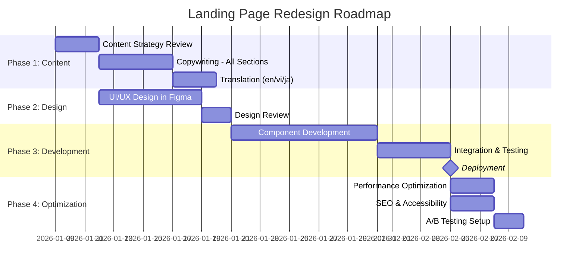

# PRD: Hana Landing Page Redesign & Content Revamp

> **Product**: Hana AI Browser Extension Landing Page | **Version**: 2.0 | **Status**: Draft
> **Created**: 2026-01-09 | **Updated**: 2026-01-09
> **Client/Stakeholder**: JV-IT Techs / Hana Product Team

---

## 1. Executive Summary

### 1.1 Product Vision

**Vision Statement**: Tạo landing page chuẩn mực cho Hana AI Browser Extension - một nền tảng AI chuyên nghiệp với 18+ tính năng đa dạng, giúp người dùng hiểu rõ giá trị thực của sản phẩm và tăng tỷ lệ cài đặt extension lên 300%.

**Current Problem**: 
- Landing page hiện tại chỉ highlight 3 tính năng cơ bản (Smart Summarization, Lightning Fast, Absolute Security)
- Nội dung thiên về messaging "local processing" không chính xác - thực tế Hana sử dụng backend API
- Thiếu showcase cho 18 features chính của sản phẩm
- UI/UX hiện tại thiếu sự phân tầng thông tin và visual impact
- Không thể hiện được tính chuyên nghiệp của một nền tảng AI toàn diện

**Proposed Solution**:
- Redesign toàn bộ content strategy để phản ánh đúng giá trị của professional AI platform
- Thiết kế lại UI/UX với focus vào visual hierarchy và showcase features
- Tối ưu hóa conversion funnel từ visitor → install → active user

### 1.2 Product Goals

| Goal ID | Goal Description | Success Metric | Priority |
|---------|------------------|----------------|----------|
| G-001 | Tăng tỷ lệ install extension từ landing page | Conversion rate tăng từ hiện tại lên 15%+ | High |
| G-002 | Truyền tải đúng giá trị của professional AI platform | Bounce rate giảm 40%, time on page tăng 2x | High |
| G-003 | Showcase đầy đủ 18 features của Hana | 80% visitors scroll qua features section | High |
| G-004 | Cải thiện trust & credibility | Trust indicators (testimonials, social proof) tăng 50% | Medium |
| G-005 | Tối ưu SEO và accessibility | SEO score 95+, accessibility score 100 | Medium |

### 1.3 Business Objectives

- **Business Value**: Landing page là primary conversion funnel cho user acquisition
- **Revenue Model**: Freemium (FREE tier → PAID subscription upgrade)
- **Market Opportunity**: 
  - Chrome Web Store có 200M+ active users
  - AI productivity tools market growing 40% YoY
  - Target: 100K users trong 6 tháng
- **Competitive Advantage**: 
  - Hana là one-stop AI platform (translation + summary + chat + docs + projects)
  - Professional-grade với project management capabilities
  - Superior UX compared to scattered AI tools

---

## 2. Market & User Analysis

### 2.1 Target Market

| Segment | Description | Size | Characteristics |
|---------|-------------|------|-----------------|
| Primary | Professionals & Knowledge Workers | 50M+ Chrome users | Content-heavy workflow, multi-project management needs |
| Secondary | Students & Researchers | 30M+ Chrome users | Academic research, multilingual content consumption |
| Tertiary | Content Creators & Writers | 10M+ Chrome users | Need AI assistance for content creation, translation |

### 2.2 User Personas

#### Persona 1: Project Manager Paul

| Attribute | Description |
|-----------|-------------|
| **Name** | Paul - Project Manager |
| **Role** | Senior Project Manager tại tech company |
| **Demographics** | Age: 32, Location: Vietnam/Singapore, Industry: Tech/IT |
| **Goals** | Quản lý multiple projects đồng thời, cần organize knowledge per project, translate technical docs |
| **Pain Points** | Switching between multiple AI tools, losing context between projects, wasting time on repetitive tasks |
| **Technology Comfort** | High - early adopter của productivity tools |
| **Usage Context** | Daily work - reading specs, translating docs, summarizing meetings, managing project knowledge |

**Key Needs**:
- Project-based context management ✅ (Hana has this)
- Fast translation with glossary ✅
- Document management per project ✅
- AI chat with project context ✅

#### Persona 2: Research Student Sarah

| Attribute | Description |
|-----------|-------------|
| **Name** | Sarah - Graduate Student |
| **Role** | Master's student studying International Relations |
| **Demographics** | Age: 24, Location: Global, Industry: Academia |
| **Goals** | Read & summarize academic papers, translate foreign language sources, organize research notes |
| **Pain Points** | Information overload, language barriers, need to process 50+ papers per week |
| **Technology Comfort** | Medium-High - uses AI tools but not power user |
| **Usage Context** | Research workflow - summarizing papers, translating sources, chatting with AI about concepts |

**Key Needs**:
- Fast summarization with multiple styles ✅
- Translation for academic content ✅
- Chat to understand complex concepts ✅
- History tracking ✅

#### Persona 3: Content Manager Minh

| Attribute | Description |
|-----------|-------------|
| **Name** | Minh - Content Operations Manager |
| **Role** | Managing content operations cho e-commerce platform |
| **Demographics** | Age: 28, Location: Vietnam, Industry: E-commerce |
| **Goals** | Coordinate với international teams, translate product descriptions, generate functional docs |
| **Pain Points** | Manual translation takes too long, inconsistent terminology, repetitive documentation work |
| **Technology Comfort** | High - tech-savvy user |
| **Usage Context** | Daily operations - translate content, maintain glossary, generate documents, manage team projects |

**Key Needs**:
- Professional translation with glossary ✅
- Functional doc generation ✅
- Team collaboration features ✅
- Terminology consistency ✅

### 2.3 Competitive Analysis

| Competitor | Strengths | Weaknesses | Our Differentiation |
|------------|-----------|------------|---------------------|
| **ChatGPT Extension** | Brand recognition, powerful AI | No project management, no specialized features, no context persistence | Hana: Project-based organization, specialized features (translation, summary, docs), persistent context |
| **Grammarly** | Excellent writing assistance | Limited to writing, no translation/summary/chat | Hana: Full AI platform with 4 core AI features + project management |
| **Google Translate Extension** | Simple, fast translation | One-trick pony, no AI capabilities beyond translation | Hana: Translation + Summary + Chat + Docs + Project Management |
| **Notion AI** | Great note-taking integration | External tool (not browser extension), expensive | Hana: Browser-native, more affordable, specialized for browsing workflow |
| **Readwise Reader** | Excellent reading experience | Limited to reading/highlights, no active AI assistance | Hana: Active AI assistance (chat, translate on-the-fly, functional docs) |

**Market Positioning**: Hana là **all-in-one AI productivity platform** built into browser, không phải single-purpose tool. Focus vào professional users với multi-project workflows.

---

## 3. Product Scope - Landing Page Redesign

### 3.1 In Scope (MVP Redesign)

| Feature ID | Feature Name | Description | Priority | Implementation Effort |
|------------|--------------|-------------|----------|----------------------|
| F-001 | Hero Section Revamp | Rewrite messaging to reflect "Professional AI Platform", not just "local AI tool" | Must Have | Medium |
| F-002 | Features Showcase Expansion | Expand from 3 features → 6-8 core feature cards với visual icons | Must Have | High |
| F-003 | Privacy Messaging Correction | Sửa messaging từ "local processing" → "secure backend with privacy-first approach" | Must Have | Low |
| F-004 | Dashboard Section Removal | Remove hoặc downgrade Dashboard preview (không phải core selling point) | Must Have | Low |
| F-005 | New: Use Cases Section | Thêm section showcase 3-4 use cases với personas (PM, Student, Creator) | Should Have | Medium |
| F-006 | Feature Deep-Dive Section | Thêm section chi tiết cho 18 features với categorization | Should Have | High |
| F-007 | Testimonials Section | Thêm social proof với real user testimonials hoặc case studies | Should Have | Medium |
| F-008 | Interactive Demo Section | Thêm interactive demo hoặc video walkthrough cho key features | Could Have | High |
| F-009 | Comparison Table | So sánh Hana vs competitors (ChatGPT, Grammarly, etc.) | Could Have | Medium |
| F-010 | Pricing Section Update | Highlight FREE tier và PAID tier với clear value proposition | Should Have | Low |

### 3.2 Out of Scope (Future Phases)

| Feature ID | Feature Name | Reason for Exclusion | Future Phase |
|------------|--------------|----------------------|--------------|
| F-101 | Blog/Resources Section | Cần content strategy riêng | Phase 2 |
| F-102 | User Community/Forum | Cần infrastructure và moderation | Phase 3 |
| F-103 | Live Chat Support | Cần customer support team | Phase 2 |
| F-104 | Multi-language Landing Pages | Cần translation + SEO strategy per language | Phase 2 |
| F-105 | AI Playground/Sandbox | Cần significant development effort | Phase 3 |

### 3.3 Content Changes Required

#### Priority 1: Messaging Strategy Overhaul

**Current Issues**:
```diff
- "Browse Smarter With AI Power" → Too generic, doesn't differentiate
- "Local Processing" → WRONG - Hana uses backend API
- "Your data never leaves your machine" → INCORRECT
- "Absolute Security... processed locally" → MISLEADING
- Only 3 features shown → INCOMPLETE
```

**Proposed New Messaging**:

**Hero Headline**:
```
Old: "Browse Smarter With AI Power"
New: "Your AI-Powered Work Platform for the Web"
Alt: "Professional AI Assistant for Modern Knowledge Workers"
Alt: "One Extension. Complete AI Workflow."
```

**Hero Description**:
```
Old: "Automatically summarizes content, manages tabs intelligently, and boosts productivity 3x"
New: "Translate, summarize, chat, and manage documents across all your projects - all in one intelligent browser extension. Built for professionals who need AI that understands context."
```

**Value Proposition** (new section):
- ✅ **4 Core AI Features**: Translation, Summarization, Chat, Document Generation
- ✅ **Project Management**: Organize everything by project with persistent context
- ✅ **18+ Specialized Tools**: From glossary management to functional doc generation
- ✅ **Professional Grade**: Built for teams and serious knowledge workers

#### Priority 2: Feature Content Expansion

**From 3 Features → 6-8 Core Features**:

1. **Smart AI Translation** (keep, enhance)
   - Multi-language translation với AI-powered accuracy
   - Project-specific glossaries for terminology consistency
   - Context-aware translation based on industry/domain

2. **Intelligent Summarization** (keep, enhance)
   - 3 summary styles: Brief, Balanced, Detailed
   - Extract key points from articles, papers, documentation
   - Save summaries per project

3. **AI Chat Assistant** (NEW - major feature!)
   - Chat about anything you're reading
   - Context-aware responses based on current page
   - Multi-turn conversations với session memory

4. **Functional Doc Generation** (NEW - unique differentiator!)
   - Auto-generate FRD (Functional Requirements) và FFD (Flow Diagrams)
   - Perfect for PMs, developers, business analysts
   - Context-aware generation using project documents

5. **Project Context Management** (NEW - professional feature!)
   - Organize work by projects
   - Each project remembers settings, glossaries, documents
   - Switch contexts seamlessly

6. **Document Management** (NEW)
   - Upload & manage project documents
   - Semantic search across documents
   - Import from Google Sheets, Notion
   - Support PDF, DOC, DOCX, TXT, MD, images

7. **Privacy & Security** (rewrite, correct messaging)
   - Secure backend infrastructure với JWT authentication
   - Role-based access control
   - HTTPS-only API calls
   - No browsing history collection
   - Data encryption in transit and at rest

8. **Lightning Performance** (keep)
   - < 50MB memory usage
   - Optimized bundle size
   - Smart caching và lazy loading

#### Priority 3: Privacy Messaging Correction

**Current (INCORRECT)**:
```
❌ "All data processed right on your device"
❌ "Data never leaves your machine"
❌ "No server uploads"
```

**Corrected**:
```
✅ "Secure Backend Infrastructure"
   - Enterprise-grade security với JWT authentication
   - Data encrypted in transit (HTTPS) and at rest
   - GDPR compliant data processing

✅ "Privacy-First Approach"
   - No browsing history collection
   - No tracking or analytics on your activity
   - You control your data - export or delete anytime

✅ "Professional Authentication"
   - Secure JWT-based authentication
   - Role-based access control
   - Auto-refresh tokens, secure session management
```

---

## 4. UI/UX Redesign Ideas

### 4.1 Overall Design Philosophy

**Current State**: 
- Minimalist zen aesthetic (zinc-50 background, teal accent)
- Clean but lacks visual impact
- Not enough hierarchy
- Features buried below the fold

**Proposed Design Direction**:
- **Elevated Professional** - maintain clean look but add sophistication
- **Feature-Forward** - features should be above or immediately at the fold
- **Visual Storytelling** - use illustrations, mockups, và micro-interactions
- **Trust-Building** - add social proof, stats, testimonials throughout

### 4.2 Layout & Structure Redesign

#### Proposed New Layout Flow:

```
┌─────────────────────────────────────────────┐
│ 1. NAVIGATION (sticky)                      │
│    - Logo + Features/Use Cases/Pricing/Login│
│    - CTA: Add to Chrome (prominent)         │
└─────────────────────────────────────────────┘

┌─────────────────────────────────────────────┐
│ 2. HERO SECTION                             │
│    - Bold Headline + Subheadline            │
│    - Value Props (4 core features)          │
│    - Primary CTA: Add to Chrome             │
│    - Secondary CTA: Watch Demo              │
│    - Hero Visual: Animated product showcase │
│    - Trust Badges: 4.9★ | 10K+ users        │
└─────────────────────────────────────────────┘

┌─────────────────────────────────────────────┐
│ 3. FEATURES OVERVIEW (immediately visible!) │
│    - 6-8 Feature Cards in 3-column grid     │
│    - Each card: Icon + Title + Description  │
│    - Hover states với subtle animations     │
└─────────────────────────────────────────────┘

┌─────────────────────────────────────────────┐
│ 4. USE CASES / WHO IS IT FOR               │
│    - 3 persona cards với stories            │
│    - "Project Manager Paul uses Hana to..." │
│    - Real-world scenarios                   │
└─────────────────────────────────────────────┘

┌─────────────────────────────────────────────┐
│ 5. HOW IT WORKS (keep, improve visuals)    │
│    - 3 steps với better illustrations       │
│    - "Install → Browse → Get Insights"      │
└─────────────────────────────────────────────┘

┌─────────────────────────────────────────────┐
│ 6. FEATURE DEEP DIVE (NEW - expandable)    │
│    - Tabs or accordion for 18 features      │
│    - Categorized: AI Features | Management  │
│                   | Integration | Admin     │
│    - Each feature: screenshot + description │
└─────────────────────────────────────────────┘

┌─────────────────────────────────────────────┐
│ 7. DASHBOARD PREVIEW (OPTIONAL - downgrade)│
│    - Keep but make less prominent           │
│    - OR remove entirely                     │
└─────────────────────────────────────────────┘

┌─────────────────────────────────────────────┐
│ 8. SOCIAL PROOF (NEW)                       │
│    - User testimonials                      │
│    - Stats showcase                         │
│    - Case studies (optional)                │
└─────────────────────────────────────────────┘

┌─────────────────────────────────────────────┐
│ 9. PRIVACY & SECURITY (redesign)            │
│    - Correct messaging (backend, secure)    │
│    - Trust indicators (HTTPS, JWT, GDPR)    │
└─────────────────────────────────────────────┘

┌─────────────────────────────────────────────┐
│ 10. COMPARISON TABLE (NEW - optional)       │
│    - Hana vs ChatGPT vs Grammarly vs Others │
│    - Feature-by-feature comparison          │
└─────────────────────────────────────────────┘

┌─────────────────────────────────────────────┐
│ 11. FAQ (keep, expand)                      │
│    - Add more questions about backend, API  │
│    - Technical questions for power users    │
└─────────────────────────────────────────────┘

┌─────────────────────────────────────────────┐
│ 12. FINAL CTA (keep)                        │
│    - Strong call-to-action                  │
│    - Free tier emphasis                     │
└─────────────────────────────────────────────┘

┌─────────────────────────────────────────────┐
│ 13. FOOTER (keep)                           │
│    - Links, copyright                       │
└─────────────────────────────────────────────┘
```

**Key Changes**:
1. **Move Features Section UP** - from 5th position → 2nd position (right after hero)
2. **Add Use Cases** - storytelling qua personas
3. **Add Feature Deep Dive** - showcase all 18 features
4. **Add Social Proof** - testimonials, stats
5. **Downgrade Dashboard** - less prominent hoặc remove
6. **Add Comparison Table** - competitive positioning

### 4.3 Visual Design Enhancements

#### Color Palette Evolution

**Current**:
- Primary: Teal-600 (#0d9488)
- Background: Zinc-50
- Text: Zinc-900

**Proposed Enhancement**:
```css
/* Keep existing colors but add depth */
--color-primary: #0d9488 (teal-600) /* keep */
--color-primary-dark: #0f766e (teal-700) /* new - for depth */
--color-primary-light: #5eead4 (teal-300) /* new - for highlights */

--color-secondary: #3b82f6 (blue-500) /* new - for AI features */
--color-accent-1: #f59e0b (amber-500) /* for performance */
--color-accent-2: #10b981 (emerald-500) /* for success states */
--color-accent-3: #8b5cf6 (violet-500) /* for premium features */

/* Backgrounds */
--bg-primary: #fafafa (zinc-50) /* keep */
--bg-secondary: #ffffff /* pure white for cards */
--bg-dark: #18181b (zinc-900) /* for dark sections */

/* Gradients (NEW) */
--gradient-hero: linear-gradient(135deg, #0d9488 0%, #3b82f6 100%)
--gradient-feature: linear-gradient(135deg, #f6f6f6 0%, #ffffff 100%)
--gradient-cta: linear-gradient(135deg, #0d9488 0%, #0f766e 100%)
```

#### Typography Enhancements

**Current**: System fonts, clean hierarchy

**Proposed**:
```css
/* Headers - add more weight variation */
.heading-xl: 5xl-7xl, font-bold, tracking-tight /* hero */
.heading-lg: 3xl-5xl, font-bold /* section titles */
.heading-md: 2xl-3xl, font-semibold /* subsections */

/* Body - add reading comfort */
.body-lg: text-xl, leading-relaxed /* hero description */
.body-md: text-lg, leading-relaxed /* feature descriptions */
.body-sm: text-base, leading-normal /* secondary content */

/* Add Google Fonts for premium feel */
Font-family: 
  - Headings: "Inter" (modern, professional)
  - Body: "Inter" (consistency)
  - Mono: "JetBrains Mono" (for code/technical content)
```

#### Component Design Ideas

**1. Feature Cards - Enhanced**

```
Current:
┌──────────────────┐
│ [Icon]           │
│ Title            │
│ Description      │
└──────────────────┘

Proposed:
┌──────────────────────────────┐
│ [Larger Icon with gradient]  │
│ Title (larger, bolder)       │
│ ────────────────             │ ← subtle divider
│ Description (more detailed)  │
│ • Highlight 1                │
│ • Highlight 2                │
│ • Highlight 3                │
│ [Learn More →]               │ ← optional link
└──────────────────────────────┘
+ Hover effect: lift + shadow
+ Subtle border-gradient on premium features
```

**2. Stats/Trust Badges - Redesign**

```
Current: Simple pills với icons
Proposed: More prominent cards

┌─────────────────────────────┐
│  ⭐⭐⭐⭐⭐ 4.9/5.0         │
│  Based on 1,247 reviews     │
└─────────────────────────────┘

┌─────────────────────────────┐
│  👥 10,000+                 │
│  Active users worldwide     │
└─────────────────────────────┘

┌─────────────────────────────┐
│  ⚡ 500K+                   │
│  AI tasks completed         │
└─────────────────────────────┘
```

**3. Use Case Cards (NEW)**

```
┌───────────────────────────────────┐
│ [Avatar] Project Manager Paul     │
│ ──────────────────────────────    │
│ "Switching between projects used  │
│ to be chaotic. Hana's project     │
│ context management changed        │
│ everything."                      │
│                                   │
│ ✓ Manages 5 projects daily        │
│ ✓ Saves 2 hours/day               │
│ ✓ Improved team collaboration     │
│                                   │
│ [See Paul's Workflow →]           │
└───────────────────────────────────┘
```

**4. Feature Deep Dive - Tabbed Interface**

```
┌────────────────────────────────────────────┐
│ [AI Features] [Project Mgmt] [Integration] │ ← tabs
├────────────────────────────────────────────┤
│                                            │
│  Translation                               │
│  ├─ AI-powered translation               │
│  ├─ Project-specific glossaries          │
│  └─ 20+ languages supported              │
│                                            │
│  Summarization                             │
│  ├─ 3 styles: Brief, Balanced, Detailed  │
│  ├─ Key points extraction                │
│  └─ Save to project history              │
│                                            │
│  [+ 6 more features...]                   │
└────────────────────────────────────────────┘
```

### 4.4 Micro-Interactions & Animations

**Proposed Additions**:

1. **Hero Section**:
   - Animated feature icons cycling through main capabilities
   - Floating browser mockup với subtle parallax effect
   - Stats counter animation when scrolled into view

2. **Feature Cards**:
   - Stagger animation on scroll (cards appear one by one)
   - Hover: slight lift (transform: translateY(-4px)) + shadow increase
   - Icon pulse animation on hover

3. **How It Works**:
   - Step numbers animated progress (1 → 2 → 3)
   - Illustration transitions between steps

4. **CTA Buttons**:
   - Add arrow animation on hover (→ moves right)
   - Ripple effect on click
   - "Add to Chrome" button: subtle gradient shimmer

5. **Comparison Table**:
   - Checkmarks animate in when scrolled into view
   - Highlight current row on hover

**Performance Consideration**: Keep animations lightweight (CSS-based, use `will-change` sparingly)

### 4.5 Responsive Design Strategy

**Breakpoints** (keep existing):
- Mobile: 320px - 767px
- Tablet: 768px - 1023px
- Desktop: 1024px+

**Mobile-Specific Improvements**:
1. **Stack features in 1 column** (instead of 3)
2. **Compress hero section** - smaller headline, single CTA
3. **Tabbed navigation** for feature deep dive
4. **Collapse comparison table** - make swipeable
5. **Sticky CTA button** at bottom of screen (mobile only)

### 4.6 Accessibility Enhancements

**Proposed**:
- ✅ All interactive elements have `:focus-visible` states
- ✅ Proper heading hierarchy (single h1, proper h2-h6)
- ✅ Alt text for all images/mockups
- ✅ Color contrast ratio 4.5:1 minimum (WCAG AA)
- ✅ Keyboard navigation support
- ✅ Screen reader friendly (aria-labels where needed)
- ✅ Reduced motion support (`prefers-reduced-motion`)

---

## 5. User Stories

> **Note**: Landing page user stories are simpler than app features.

### 5.1 Epic 1: First-Time Visitor Discovery

**Epic Description**: Người dùng lần đầu truy cập landing page để tìm hiểu về Hana

| Story ID | User Story | Priority | Acceptance Criteria |
|----------|------------|----------|---------------------|
| US-001 | As a **first-time visitor**, I want to **immediately understand what Hana does**, so that I can **decide if it's relevant to me** | High | - Hero headline clearly states value prop<br>- Subheadline explains core capabilities<br>- Visual mockup shows product in action |
| US-002 | As a **potential user**, I want to **see all available features**, so that I can **evaluate if Hana meets my needs** | High | - Features section visible above fold or immediately after hero<br>- 6-8 core features displayed<br>- Each feature has icon, title, description |
| US-003 | As a **concerned user**, I want to **understand how Hana handles my data**, so that I can **trust the product** | High | - Privacy section với accurate information<br>- Clear explanation of backend architecture<br>- Security features highlighted |

### 5.2 Epic 2: Evaluation & Comparison

| Story ID | User Story | Priority | Acceptance Criteria |
|----------|------------|----------|---------------------|
| US-004 | As a **power user**, I want to **compare Hana with alternatives**, so that I can **make an informed decision** | Medium | - Comparison table available (optional)<br>- Clear differentiation from competitors<br>- "Why Hana?" section |
| US-005 | As a **professional user**, I want to **see real use cases**, so that I can **imagine how I would use Hana** | Medium | - Use cases section với 3 personas<br>- Real-world scenarios<br>- Relatable stories |
| US-006 | As a **technical user**, I want to **explore all 18 features in detail**, so that I can **understand the full capabilities** | Medium | - Feature deep dive section<br>- Categorized by feature type<br>- Expandable/tabbable interface |

### 5.3 Epic 3: Conversion

| Story ID | User Story | Priority | Acceptance Criteria |
|----------|------------|----------|---------------------|
| US-007 | As a **convinced visitor**, I want to **easily install Hana**, so that I can **start using it immediately** | High | - CTA buttons prominent and clear<br>- Direct link to Chrome Store<br>- No friction in install process |
| US-008 | As a **hesitant user**, I want to **see social proof**, so that I can **feel confident installing** | Medium | - Testimonials section<br>- User stats (10K+ users, 4.9★)<br>- Trust badges |
| US-009 | As a **budget-conscious user**, I want to **understand pricing**, so that I can **know if it fits my budget** | High | - Clear FREE tier messaging<br>- Pricing section với feature breakdown<br>- "No credit card required" |

---

## 6. Success Metrics & KPIs

### 6.1 Product Metrics

| Metric ID | Metric Name | Current | Target | Measurement Method | Frequency |
|-----------|-------------|---------|--------|-------------------|-----------|
| M-001 | Landing Page Conversion Rate | ~5% (est.) | 15%+ | Google Analytics / Chrome Store installs | Weekly |
| M-002 | Bounce Rate | ~60% (est.) | < 40% | Google Analytics | Weekly |
| M-003 | Average Time on Page | ~45s (est.) | 2+ minutes | Google Analytics | Weekly |
| M-004 | Feature Section Scroll-Through | Unknown | 80%+ | Scroll tracking (GA4) | Weekly |
| M-005 | CTA Click-Through Rate | Unknown | 25%+ | Button click tracking | Daily |

### 6.2 Business Metrics

| Metric ID | Metric Name | Target | Measurement Method | Frequency |
|-----------|-------------|--------|-------------------|-----------|
| BM-001 | New User Acquisition | 1000+/month | Chrome Store analytics | Monthly |
| BM-002 | FREE → PAID Conversion | 5%+ | Backend subscription data | Monthly |
| BM-003 | User Retention (30-day) | 40%+ | Backend user activity logs | Monthly |

### 6.3 Technical Metrics

| Metric ID | Metric Name | Target | Measurement Method | Frequency |
|-----------|-------------|--------|-------------------|-----------|
| TM-001 | Page Load Time (LCP) | < 2.5s | Lighthouse / PageSpeed Insights | Daily |
| TM-002 | First Contentful Paint | < 1.8s | Lighthouse | Daily |
| TM-003 | Cumulative Layout Shift | < 0.1 | Lighthouse | Daily |
| TM-004 | SEO Score | 95+ | Lighthouse | Weekly |
| TM-005 | Accessibility Score | 100 | Lighthouse | Weekly |

---

## 7. Content Strategy & Copywriting

### 7.1 Messaging Framework

**Main Tagline Options**:
1. "Your AI-Powered Work Platform for the Web" _(professional, clear)_
2. "One Extension. Complete AI Workflow." _(concise, powerful)_
3. "Professional AI Assistant for Modern Knowledge Workers" _(targeted)_

**Recommended**: Option 2 - "One Extension. Complete AI Workflow."

**Supporting Headline**:
"Translate, summarize, chat, and manage documents across all your projects. The only browser extension built for professionals who need AI that understands context."

### 7.2 Feature Descriptions Rewrite

**1. Smart AI Translation**
```
Title: AI Translation with Project Memory
Description: Translate anything instantly với AI-powered accuracy. 
Hana remembers your project-specific terminology, ensuring 
consistent translations across all your work.

Highlights:
• 20+ languages supported
• Custom glossaries per project
• Context-aware translation
• Industry-specific vocabulary
```

**2. Intelligent Summarization**
```
Title: Multi-Style Summarization
Description: Get the gist of any article, paper, or documentation 
in seconds. Choose from Brief, Balanced, or Detailed summaries 
based on your needs.

Highlights:
• 3 summary styles
• Extract key points automatically
• Save summaries per project
• Works on any webpage
```

**3. AI Chat Assistant**
```
Title: Context-Aware AI Chat
Description: Chat with AI about anything you're reading. Hana 
understands the current page context and provides intelligent 
responses based on your project knowledge.

Highlights:
• Chat about current page content
• Multi-turn conversations
• Project-specific context
• Session history
```

**4. Functional Doc Generation**
```
Title: Auto-Generate Professional Documents
Description: Automatically create Functional Requirements Documents 
(FRD) and Flow Diagrams (FFD) from feature descriptions. Perfect 
for PMs, developers, and business analysts.

Highlights:
• FRD + FFD generation
• Context-aware using project docs
• Professional formatting
• Export-ready documents
```

**5. Project Context Management**
```
Title: Work Organized by Projects
Description: Switch between projects seamlessly. Hana remembers 
settings, glossaries, and documents for each project, so you never 
lose context.

Highlights:
• Unlimited projects
• Persistent context per project
• Settings auto-switch
• Team collaboration ready
```

**6. Document Management**
```
Title: Centralized Document Hub
Description: Upload, search, and manage all project documents in 
one place. Import from Google Sheets or Notion. Semantic search 
across all content.

Highlights:
• Support PDF, DOC, DOCX, TXT, MD, images
• Semantic search powered by AI
• Import from Google Sheets, Notion
• Version control
```

**7. Privacy & Security** (CORRECTED)
```
Title: Enterprise-Grade Security
Description: Your data is protected with industry-standard security. 
JWT authentication, HTTPS encryption, role-based access control. 
We don't collect browsing history or track your activity.

Highlights:
• Secure backend infrastructure
• JWT authentication
• HTTPS encryption (in transit + at rest)
• GDPR compliant
```

**8. Lightning Performance**
```
Title: Fast & Lightweight
Description: Optimized to use less than 50MB memory. Smart caching, 
lazy loading, and background processing ensure Hana never slows 
down your browser.

Highlights:
• < 50MB memory usage
• Instant load times
• Smart caching
• Zero browser slowdown
```

### 7.3 Voice & Tone Guidelines

- **Voice**: Professional yet approachable, confident, helpful
- **Tone**: Informative without being overwhelming, trustworthy
- **Style**: 
  - Short sentences for clarity
  - Active voice
  - Technical terms OK (target = professionals)
  - Avoid marketing fluff - be specific and honest
  
**Example**:
❌ "Experience the revolutionary power of next-generation AI"
✅ "Translate, summarize, and chat with AI - all in one extension"

---

## 8. Technical Requirements

### 8.1 Frontend Tech Stack (Keep Existing)

- **Framework**: React 19 + TypeScript
- **Build Tool**: Vite
- **Styling**: TailwindCSS + custom CSS
- **Animations**: Framer Motion (already in use)
- **i18n**: react-i18next (already in use)
- **Icons**: Lucide React (already in use)

### 8.2 New Components Required

| Component | Purpose | Complexity |
|-----------|---------|------------|
| `UseCaseCard.tsx` | Display persona use cases | Low |
| `FeatureDeepDive.tsx` | Tabbed/accordion interface for 18 features | Medium |
| `ComparisonTable.tsx` | Feature comparison với competitors | Medium |
| `TestimonialCard.tsx` | User testimonials | Low |
| `StatsCounter.tsx` | Animated counter for stats | Low |
| `FeatureCategoryTabs.tsx` | Organize features by category | Medium |

### 8.3 Content Structure (i18n Updates)

**New Translation Keys Needed**:
```json
{
  "hero": {
    "newHeadline": "One Extension. Complete AI Workflow.",
    "newDescription": "Translate, summarize, chat, and manage documents...",
    "valueProp1": "4 Core AI Features",
    "valueProp2": "Project Management",
    "valueProp3": "18+ Specialized Tools"
  },
  "useCases": {
    "title": "Who Uses Hana?",
    "persona1": { ... },
    "persona2": { ... },
    "persona3": { ... }
  },
  "featureDeepDive": {
    "title": "Explore All Features",
    "categories": {
      "aiFeatures": "AI Features",
      "projectManagement": "Project Management",
      "integration": "Integration & Admin"
    }
  },
  "comparison": {
    "title": "How Hana Compares",
    "competitors": [ ... ],
    "features": [ ... ]
  },
  "testimonials": {
    "title": "Trusted by Professionals",
    "items": [ ... ]
  }
}
```

### 8.4 Performance Requirements

- **Total Bundle Size**: < 300KB gzipped (currently ~250KB)
- **Lighthouse Score**: 
  - Performance: 90+
  - Accessibility: 100
  - Best Practices: 95+
  - SEO: 95+
- **Core Web Vitals**:
  - LCP: < 2.5s
  - FID: < 100ms
  - CLS: < 0.1

### 8.5 SEO Requirements

**Meta Tags**:
```html
<title>Hana - AI-Powered Work Platform for the Web | Browser Extension</title>
<meta name="description" content="Professional AI assistant with translation, summarization, chat, and document management. Built for knowledge workers. Free Chrome extension.">
<meta name="keywords" content="AI browser extension, translation, summarization, AI chat, document management, project management, productivity tool">
```

**Structured Data** (Schema.org):
- SoftwareApplication schema
- Aggregate rating schema (if have reviews)
- Organization schema

**Open Graph**:
```html
<meta property="og:title" content="Hana - Complete AI Workflow in One Extension">
<meta property="og:description" content="Translate, summarize, chat, manage documents - all powered by AI">
<meta property="og:image" content="[hero-image-url]">
<meta property="og:type" content="website">
```

---

## 9. Implementation Roadmap

### 9.1 Timeline Overview



### 9.2 Phase Details

#### Phase 1: Content Strategy & Copywriting (11 days)

**Week 1**:
- ✅ Review & approve PRD (this document)
- Write all new copy for sections
- Create use case stories (3 personas)
- Draft feature descriptions for all 18 features

**Deliverables**:
- Complete copy document với all sections
- i18n JSON files updated (en/vi/ja)
- Content approved by stakeholders

#### Phase 2: UI/UX Design (9 days)

**Week 2**:
- Create high-fidelity designs in Figma
- Design all new components (Use Cases, Feature Deep Dive, Testimonials)
- Create responsive versions (mobile, tablet, desktop)
- Design review session

**Deliverables**:
- Figma designs for all sections
- Component library
- Design system documentation
- Approved designs

#### Phase 3: Development (15 days)

**Week 3-4**:
- Develop new components
- Update existing components (Hero, Features, Privacy)
- Implement responsive layouts
- Integration testing
- Cross-browser testing
- Deployment to production

**Deliverables**:
- Fully functional landing page
- All components implemented
- Responsive on all devices
- Deployed to production

#### Phase 4: Optimization & Launch (8 days)

**Week 5**:
- Performance optimization (bundle size, lazy loading)
- SEO optimization (meta tags, structured data)
- Accessibility audit
- A/B testing setup (optional)
- Analytics tracking setup
- Launch!

**Deliverables**:
- Optimized landing page (Lighthouse 90+)
- SEO setup complete
- Analytics tracking configured
- A/B test variants ready (optional)

---

## 10. Risk Assessment

| Risk ID | Risk Description | Probability | Impact | Mitigation Strategy | Owner |
|---------|------------------|-------------|--------|---------------------|-------|
| R-001 | Content accuracy issues (privacy claims) | Medium | High | Thorough review với backend team to verify all claims | Product Team |
| R-002 | Design feedback delays | Medium | Medium | Set strict review timelines, involve stakeholders early | Design Lead |
| R-003 | Performance degradation với new features | Low | High | Regular performance testing, lazy loading, code splitting | Dev Team |
| R-004 | Translation quality issues | Medium | Low | Use professional translator, not just AI translation | Content Team |
| R-005 | User confusion với too many features shown | Medium | Medium | User testing, simplify categories, progressive disclosure | UX Designer |
| R-006 | SEO ranking drop during migration | Low | High | Maintain URL structure, proper redirects, test before launch | SEO Specialist |
| R-007 | Browser compatibility issues | Low | Medium | Cross-browser testing (Chrome, Edge, Firefox, Safari) | QA Team |

---

## 11. Dependencies & Integrations

### 11.1 Internal Dependencies

| Dependency ID | Dependency Name | Type | Impact if Delayed | Owner |
|---------------|-----------------|------|-------------------|-------|
| D-001 | Backend API Documentation | Documentation | Cannot write accurate privacy messaging | Backend Team |
| D-002 | Extension Screenshots/Mockups | Design Assets | Cannot showcase product visually | Design Team |
| D-003 | User Testimonials Collection | Content | Social proof section incomplete | Marketing Team |
| D-004 | Chrome Store Stats | Data | Cannot show accurate user numbers | Analytics Team |

### 11.2 External Dependencies

| Dependency ID | Dependency Name | Type | Impact if Delayed | Owner |
|---------------|-----------------|------|-------------------|-------|
| D-101 | Google Fonts API | External Service | Fallback to system fonts (minor impact) | N/A |
| D-102 | Framer Motion Library | NPM Package | Already integrated, no risk | Dev Team |
| D-103 | YouTube API (for video popup) | External Service | Video demo unavailable (minor impact) | N/A |

---

## 12. Compliance & Legal

### 12.1 Data Privacy

- **Accurate Privacy Claims**: Ensure all messaging accurately reflects backend architecture
- **GDPR Compliance**: Privacy policy updated to reflect backend data processing
- **User Consent**: Cookie banner if analytics implemented
- **Terms of Service**: Updated to reflect new features showcased

### 12.2 Trademark & Copyright

- **Hana Branding**: Ensure consistent brand usage
- **Competitor Mentions**: Legal review for comparison table (if implemented)
- **Stock Images**: Use licensed images only
- **Icon Licensing**: Lucide React icons are MIT licensed (OK to use)

---

## 13. Appendices

### 13.1 Glossary

| Term | Definition |
|------|------------|
| **FRD** | Functional Requirements Document - detailed specification of feature requirements |
| **FFD** | Functional Flow Document - visual flow diagram of feature behavior |
| **LCP** | Largest Contentful Paint - Core Web Vital metric for page load performance |
| **JWT** | JSON Web Token - authentication mechanism used by Hana backend |
| **Conversion Rate** | Percentage of visitors who install the extension |
| **Bounce Rate** | Percentage of visitors who leave without interaction |

### 13.2 References

| Type | Path/Link |
|------|--------------|
| Feature Report | `ALL_FEATURES_REPORT.md` |
| Current Landing Page | `index.html`, `src/App.tsx` |
| Translations | `src/i18n/locales/*.json` |
| Design Assets | `src/assets/` |
| Chrome Store | https://chromewebstore.google.com/detail/hana/... |

### 13.3 Related Documents

- [ ] Copywriting Document (to be created in Phase 1)
- [ ] Figma Design Files (to be created in Phase 2)
- [ ] A/B Testing Plan (optional - Phase 4)
- [ ] Analytics Tracking Specification (Phase 4)

---

## 14. Next Steps & Action Items

### Immediate Actions (This Week)

1. **Review & Approve PRD** 👈 YOU ARE HERE
   - [ ] Product team reviews this document
   - [ ] Backend team verifies privacy/security claims
   - [ ] Stakeholders approve direction

2. **Content Creation**
   - [ ] Assign copywriter for all sections
   - [ ] Collect user testimonials (if available)
   - [ ] Gather Chrome Store stats

3. **Design Kickoff**
   - [ ] Create design brief based on this PRD
   - [ ] Schedule design review meetings
   - [ ] Assign UI/UX designer

### Phase 1 Deliverables (Week 1-2)

- [ ] Complete copy document
- [ ] Updated i18n JSON files
- [ ] Use case stories written
- [ ] Feature descriptions for all 18 features

### Success Criteria

**This redesign is successful if**:
1. ✅ Conversion rate improves from ~5% → 15%+
2. ✅ Users understand Hana is a professional AI platform (not just a simple tool)
3. ✅ All 18 features are discoverable on landing page
4. ✅ Privacy messaging is 100% accurate
5. ✅ Lighthouse scores: Performance 90+, Accessibility 100, SEO 95+
6. ✅ Bounce rate drops below 40%

---

## Version History

| Version | Date | Author | Changes |
|---------|------|--------|---------|
| 1.0 | 2026-01-09 | AI Agent (Cascade) | Initial PRD creation based on ALL_FEATURES_REPORT.md and current landing page analysis |

---

**Document Status**: 📝 **DRAFT** - Awaiting stakeholder review

**Recommended Next Action**: Review this PRD → Approve → Begin Phase 1 (Content Strategy)
