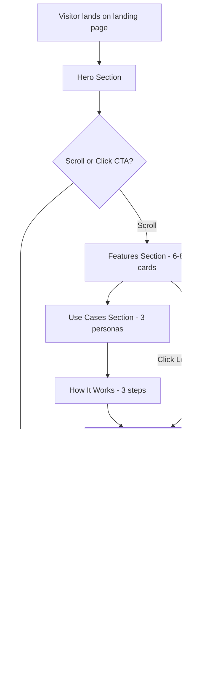

# FRD: Landing Page Redesign (Frontend)

> **Feature**: landing-page-redesign | **Priority**: High | **Status**: Draft
> **Platform**: Web | **Version**: 2.0 | **Updated**: 2026-01-09

---

## 1. Tổng quan (Overview)

| Item | Mô tả |
|------|-------|
| **Mục đích (Purpose)** | Redesign landing page để showcase đầy đủ 18 features của Hana, correct privacy messaging, và tối ưu conversion rate |
| **Phạm vi (Scope)** | Bao gồm: Hero section, Features (6-8), Use Cases, How It Works, Feature Deep Dive, Privacy, FAQ, CTA | Không bao gồm: Blog, User forum, Live chat |
| **Người dùng (Users)** | First-time visitors, potential users, professional users evaluating extension |
| **Pages/Routes** | `/` (single page landing) |
| **Dependencies** | PRD-landing-page-redesign.md |

---

## 2. User Stories

### US-001: Hiểu Ngay Giá Trị Của Hana

**As** first-time visitor, **I want** immediately understand what Hana does và its key value props, **so that** I can decide if it's relevant to my needs.

**Acceptance Criteria**:
- [ ] AC-001: Hero headline "One Extension. Complete AI Workflow." hiển thị rõ ràng
- [ ] AC-002: 4 value props (Translation, Summary, Chat, Docs) hiển thị trong hero
- [ ] AC-003: CTA "Add to Chrome" prominent và clickable
- [ ] AC-004: Trust badges (4.9★, 10K+ users) visible

| Attribute | Value |
|-----------|-------|
| Priority | High |

---

### US-002: Khám Phá Tất Cả Features

**As** potential user, **I want** see all available features của Hana, **so that** I can evaluate if it meets my needs.

**Acceptance Criteria**:
- [ ] AC-005: Features section hiển thị 6-8 core features (not just 3)
- [ ] AC-006: Each feature card có icon + title + description + highlights
- [ ] AC-007: Features section visible immediately after hero (position #2)
- [ ] AC-008: Feature Deep Dive cho phép explore all 18 features

| Attribute | Value |
|-----------|-------|
| Priority | High |

---

### US-003: Hiểu Rõ Security & Privacy

**As** privacy-conscious user, **I want** understand how Hana handles my data, **so that** I can trust the product.

**Acceptance Criteria**:
- [ ] AC-009: Privacy section có correct messaging (backend, HTTPS, JWT, GDPR)
- [ ] AC-010: **Không** còn "local processing" hoặc "data never leaves machine"
- [ ] AC-011: Security features highlighted (encryption, auth, no tracking)

| Attribute | Value |
|-----------|-------|
| Priority | **Critical** |

---

### US-004: Xem Real-World Use Cases

**As** professional user, **I want** see how others use Hana, **so that** I can imagine how I would use it.

**Acceptance Criteria**:
- [ ] AC-012: Use Cases section có 3 persona cards (PM, Student, Content Manager)
- [ ] AC-013: Each persona card có quote, highlights, và link to more info
- [ ] AC-014: Use cases relatable to target audiences

| Attribute | Value |
|-----------|-------|
| Priority | Medium |

---

### US-005: Easy Installation

**As** convinced visitor, **I want** easily install Hana, **so that** I can start using it immediately.

**Acceptance Criteria**:
- [ ] AC-015: CTA button links directly to Chrome Web Store
- [ ] AC-016: CTA appears multiple times (hero, after features, final CTA)
- [ ] AC-017: "Free forever, no credit card" messaging clear

| Attribute | Value |
|-----------|-------|
| Priority | High |

---

## 3. UI Behavior Rules

| ID | Rule Name | Trigger | Behavior |
|----|-----------|---------|----------|
| UB-001 | Feature Card Hover | Mouse hover on feature card | Card lifts (translateY(-4px)), shadow increases |
| UB-002 | Stats Counter | Section scrolls into view | Numbers animate counting up (e.g., 0 → 10,000) |
| UB-003 | CTA Arrow Animation | Mouse hover on CTA | Arrow icon slides right |
| UB-004 | Feature Category Tabs | Click on tab | Content switches to selected category |
| UB-005 | Testimonial Carousel | Auto-rotate or swipe | Testimonials cycle every 5 seconds |

---

## 4. User Flow (UX Journey)

---

## 5. Non-Functional Requirements

| ID | Category | Requirement | Metric |
|----|----------|-------------|--------|
| NFR-001 | Performance | Largest Contentful Paint | < 2.5s |
| NFR-002 | Performance | First Input Delay | < 100ms |
| NFR-003 | Performance | Cumulative Layout Shift | < 0.1 |
| NFR-004 | Performance | Bundle size | < 300KB gzipped |
| NFR-005 | Responsiveness | Breakpoints support | 320px - 2560px |
| NFR-006 | Accessibility | WCAG compliance | Level AA |
| NFR-007 | Accessibility | Screen reader support | aria-labels implemented |
| NFR-008 | SEO | Lighthouse SEO score | 95+ |

---

## 6. UI States & Feedback

| State | Visual Display | User Action |
|-------|----------------|-------------|
| Initial Load | Skeleton placeholders for images | Wait |
| Hero Loaded | Full hero với animations | Scroll or click CTA |
| Feature Hovered | Card lift + shadow | Click for details |
| Video Popup | Modal overlay với video | Close or watch |
| CTA Clicked | Button feedback + redirect | Navigate to store |

---

## 7. Content Requirements

### 7.1 Hero Section Content

| Element | Content |
|---------|---------|
| Badge | "Trusted by 10,000+ professionals" |
| Headline | "One Extension. Complete AI Workflow." |
| Subheadline | "Translate, summarize, chat, and manage documents across all your projects - all in one intelligent browser extension." |
| CTA Primary | "Add to Chrome - It's Free" |
| CTA Secondary | "Watch Demo" |
| Stats | 4.9★ on Chrome Store, 10K+ users, Save 2h/day |

### 7.2 Features Section Content (6-8 Cards)

1. **AI Translation** - Multi-language với project glossaries
2. **Smart Summarization** - 3 styles (Brief, Balanced, Detailed)
3. **AI Chat Assistant** - Context-aware conversations
4. **Functional Doc Generation** - Auto FRD/FFD
5. **Project Context Management** - Organize by projects
6. **Document Management** - Upload, search, import
7. **Enterprise Security** - JWT, HTTPS, GDPR (CORRECTED messaging)
8. **Lightning Performance** - <50MB memory

### 7.3 Privacy Section Content (CORRECTED)

| Old (REMOVE) | New (ADD) |
|--------------|-----------|
| ❌ "Local Processing" | ✅ "Secure Backend Infrastructure" |
| ❌ "Data never leaves your machine" | ✅ "Data encrypted in transit and at rest" |
| ❌ "No server uploads" | ✅ "No browsing history collection" |
| ❌ Security Audited (implies local) | ✅ "GDPR compliant, JWT auth" |

---

## References

| Type | Path/Link |
|------|-----------|
| PRD | `docs/PRD-landing-page-redesign.md` |
| TDD (Frontend) | `docs/features/landing-page-redesign/TDD-landing-page-redesign.md` |
| Test Scenarios | `docs/features/landing-page-redesign/TEST-landing-page-redesign.md` |
| Current Landing Page | `src/App.tsx` |
