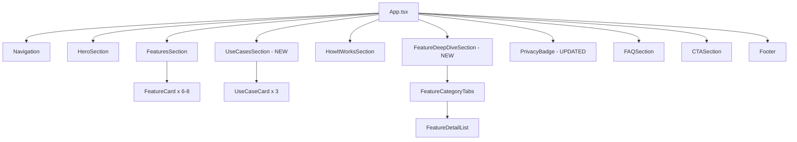
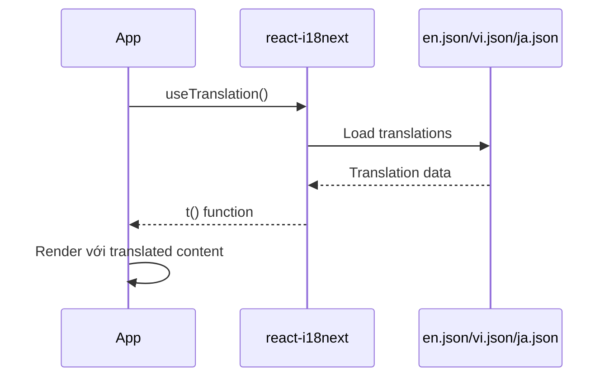

# TDD: Landing Page Redesign (Frontend)

> **Feature**: landing-page-redesign | **Complexity**: Medium
> **Framework**: React 19 + Vite + TailwindCSS | **Version**: 2.0 | **Updated**: 2026-01-09

---

## 1. Design Overview

| Item | Description |
|------|-------------|
| **Purpose** | Implement landing page redesign to showcase 18 features, correct privacy messaging, và improve conversion |
| **Actors** | First-time visitors, professional users |
| **Key Decisions** | - Keep React + Framer Motion stack<br>- Expand features from 3 → 6-8<br>- Add tabbed Feature Deep Dive<br>- Correct privacy messaging<br>- Move Features section to position #2 |

**Component Tree**:
```
App.tsx
├── Navigation (sticky header)
├── HeroSection (enhanced)
│   ├── Badge, Headline, Description
│   ├── Value Props (NEW - 4 items)
│   ├── CTAs (Primary + Secondary)
│   └── TrustBadges (Stats)
├── FeaturesSection (EXPANDED - 6-8 cards, MOVED UP)
│   └── FeatureCard (enhanced với highlights)
├── UseCasesSection (NEW)
│   └── UseCaseCard (NEW component)
├── HowItWorksSection (keep)
│   └── StepCard
├── FeatureDeepDiveSection (NEW)
│   ├── FeatureCategoryTabs (NEW component)
│   └── FeatureDetailList
├── DashboardPreviewSection (REMOVE or downgrade)
├── PrivacyBadge (CORRECT messaging)
├── FAQSection (expand)
├── CTASection (keep)
└── Footer (keep)
```

---

## 2. Roles & Permissions (UI)

> **SKIP**: Public landing page - no role-based permissions

---

## 3. State Management

### Local State (Component)

```typescript
// App.tsx
const [isVideoOpen, setIsVideoOpen] = useState(false);
const [activeFeatureCategory, setActiveFeatureCategory] = useState<'ai' | 'project' | 'integration'>('ai');

// StatsCounter.tsx (NEW)
const [animatedValue, setAnimatedValue] = useState(0);
const [hasAnimated, setHasAnimated] = useState(false);
```

### i18n State (Global)

```typescript
// Already managed by react-i18next
const { t, i18n } = useTranslation();
```

---

## 4. API Integration

> **SKIP**: Landing page is static, no API calls

---

## 5. Architecture & Flow

### Component Communication



### Data Flow (i18n)



---

## 6. Implementation Files

| File Path | Action | Description |
|-----------|--------|-------------|
| `src/i18n/locales/en.json` | MODIFY | Update hero, features, privacy, add use cases |
| `src/i18n/locales/vi.json` | MODIFY | Vietnamese translations |
| `src/i18n/locales/ja.json` | MODIFY | Japanese translations |
| `src/App.tsx` | MODIFY | Reorder sections, expand features, add new sections |
| `src/components/FeatureCard.tsx` | MODIFY | Add highlights support |
| `src/components/PrivacyBadge.tsx` | MODIFY | **CRITICAL**: Correct privacy messaging |
| `src/components/UseCaseCard.tsx` | CREATE | New persona card component |
| `src/components/FeatureDeepDive.tsx` | CREATE | Tabbed 18-feature showcase |
| `src/components/TestimonialCard.tsx` | CREATE | User testimonial card (optional) |
| `src/components/StatsCounter.tsx` | CREATE | Animated counter for stats |
| `src/components/FeatureCategoryTabs.tsx` | CREATE | Category tabs for feature deep dive |
| `src/index.css` | MODIFY | New colors, gradients, animations |

---

## 7. Error Handling (UI)

> **SKIP**: Static landing page - no error states needed

---

## 8. Implementation Details

### 8.1 Hero Section Enhancement

```typescript
// Thêm Value Props vào hero
const valueProps = [
  { icon: Languages, text: t('hero.valueProp.translation') },
  { icon: FileText, text: t('hero.valueProp.summary') },
  { icon: MessageSquare, text: t('hero.valueProp.chat') },
  { icon: FolderKanban, text: t('hero.valueProp.projects') },
];
```

### 8.2 Features Section - Expand from 3 to 6-8

```typescript
// Hiện tại: 3 features
// Mới: 6-8 features với categories

const features = [
  { 
    id: 'translation',
    icon: <Languages />, 
    title: t('features.translation.title'),
    description: t('features.translation.description'),
    highlights: [
      t('features.translation.highlight1'),
      t('features.translation.highlight2'),
      t('features.translation.highlight3'),
    ]
  },
  // ... 5-7 more features
];
```

### 8.3 FeatureCard Enhancement

```tsx
interface FeatureCardProps {
  icon: React.ReactNode;
  title: string;
  description: string;
  highlights?: string[]; // NEW
}

export function FeatureCard({ icon, title, description, highlights }: FeatureCardProps) {
  return (
    <motion.div
      whileHover={{ y: -4, boxShadow: '0 10px 30px rgba(0,0,0,0.1)' }}
      className="card-zen p-6 rounded-2xl"
    >
      <div className="w-12 h-12 rounded-xl bg-gradient-to-br from-teal-500 to-blue-500 flex items-center justify-center mb-4">
        {icon}
      </div>
      <h3 className="text-xl font-bold mb-2">{title}</h3>
      <p className="text-zinc-600 mb-4">{description}</p>
      {highlights && (
        <ul className="space-y-2">
          {highlights.map((h, i) => (
            <li key={i} className="flex items-center gap-2 text-sm text-zinc-500">
              <Check className="w-4 h-4 text-teal-500" />
              {h}
            </li>
          ))}
        </ul>
      )}
    </motion.div>
  );
}
```

### 8.4 UseCaseCard (NEW)

```tsx
interface UseCaseCardProps {
  avatar: string;
  name: string;
  role: string;
  quote: string;
  highlights: string[];
}

export function UseCaseCard({ avatar, name, role, quote, highlights }: UseCaseCardProps) {
  return (
    <motion.div 
      whileHover={{ y: -4 }}
      className="bg-white rounded-2xl p-6 border border-zinc-100 shadow-sm"
    >
      <div className="flex items-center gap-4 mb-4">
        <div className="w-12 h-12 rounded-full bg-gradient-to-br from-teal-400 to-blue-500" />
        <div>
          <h4 className="font-bold">{name}</h4>
          <p className="text-sm text-zinc-500">{role}</p>
        </div>
      </div>
      <blockquote className="text-zinc-600 italic mb-4">"{quote}"</blockquote>
      <ul className="space-y-2">
        {highlights.map((h, i) => (
          <li key={i} className="flex items-center gap-2 text-sm">
            <Check className="w-4 h-4 text-emerald-500" />
            {h}
          </li>
        ))}
      </ul>
    </motion.div>
  );
}
```

### 8.5 Privacy Badge - CRITICAL FIX

```tsx
// CURRENT (WRONG):
const privacyFeatures = [
  { icon: Cpu, title: 'Local Processing', description: 'All data processed on your device' },
  { icon: EyeOff, title: 'Zero Tracking', description: 'No browsing history' },
  { icon: Upload, title: 'No Server Uploads', description: 'Data never leaves machine' },
  { icon: Shield, title: 'Security Audited', description: 'Codebase reviewed' },
];

// NEW (CORRECT):
const securityFeatures = [
  { icon: Lock, title: t('privacy.secure.title'), description: t('privacy.secure.description') },
  // "Secure Backend" - Enterprise-grade với JWT authentication
  { icon: Shield, title: t('privacy.encrypted.title'), description: t('privacy.encrypted.description') },
  // "Data Encrypted" - HTTPS in transit, encrypted at rest
  { icon: EyeOff, title: t('privacy.noTracking.title'), description: t('privacy.noTracking.description') },
  // "No Tracking" - No browsing history collection
  { icon: Check, title: t('privacy.gdpr.title'), description: t('privacy.gdpr.description') },
  // "GDPR Compliant" - Data protection standards
];
```

### 8.6 Section Reordering in App.tsx

```tsx
// CURRENT ORDER:
// 1. Hero
// 2. How It Works
// 3. Dashboard Preview
// 4. Features (3 cards)
// 5. Privacy Badge
// 6. FAQ
// 7. CTA

// NEW ORDER:
// 1. Hero (enhanced)
// 2. Features (6-8 cards) ← MOVED UP
// 3. Use Cases (NEW)
// 4. How It Works
// 5. Feature Deep Dive (NEW)
// 6. Dashboard Preview (REMOVE or downgrade)
// 7. Privacy Badge (CORRECTED)
// 8. FAQ (expanded)
// 9. CTA
```

### 8.7 Styling Updates (index.css)

```css
/* New gradient backgrounds */
.bg-gradient-hero {
  background: linear-gradient(135deg, #0d9488 0%, #3b82f6 100%);
}

.bg-gradient-cta {
  background: linear-gradient(135deg, #0f766e 0%, #0d9488 100%);
}

/* Feature card hover effect */
.feature-card:hover {
  transform: translateY(-4px);
  box-shadow: 0 10px 30px rgba(0, 0, 0, 0.1);
}

/* Animated stats counter */
@keyframes countUp {
  from { opacity: 0; transform: translateY(10px); }
  to { opacity: 1; transform: translateY(0); }
}
```

---

## 9. i18n Keys Required

### New Translation Keys (en.json)

```json
{
  "hero": {
    "badge": "Trusted by 10,000+ professionals",
    "headline1": "One Extension.",
    "headline2": "Complete AI Workflow.",
    "description": "Translate, summarize, chat, and manage documents across all your projects - all in one intelligent browser extension.",
    "valueProp": {
      "translation": "AI Translation",
      "summary": "Smart Summarization", 
      "chat": "Context-Aware Chat",
      "projects": "Project Management"
    }
  },
  "features": {
    "title": "Everything You Need",
    "subtitle": "6 powerful AI features in one extension",
    "translation": { "title": "...", "description": "...", "highlight1": "...", "highlight2": "...", "highlight3": "..." },
    "summary": { ... },
    "chat": { ... },
    "docs": { ... },
    "projects": { ... },
    "documents": { ... },
    "security": { ... },
    "performance": { ... }
  },
  "useCases": {
    "title": "Who Uses Hana?",
    "subtitle": "Real stories from professionals",
    "pm": { "name": "Paul", "role": "Project Manager", "quote": "...", "highlights": [...] },
    "student": { ... },
    "creator": { ... }
  },
  "featureDeepDive": {
    "title": "Explore All Features",
    "tabs": {
      "ai": "AI Features",
      "project": "Project Management",
      "integration": "Integration & Admin"
    },
    "features": { ... } 
  },
  "privacy": {
    "title": "Enterprise-Grade Security",
    "subtitle": "Your data, protected",
    "secure": { "title": "Secure Backend", "description": "JWT authentication, HTTPS" },
    "encrypted": { "title": "Data Encrypted", "description": "In transit and at rest" },
    "noTracking": { "title": "No Tracking", "description": "No browsing history collection" },
    "gdpr": { "title": "GDPR Compliant", "description": "Data protection standards" }
  }
}
```

---

## References

| Type | Path/Link |
|------|-----------|
| FRD | `docs/features/landing-page-redesign/FRD-landing-page-redesign.md` |
| PRD | `docs/PRD-landing-page-redesign.md` |
| Test Scenarios | `docs/features/landing-page-redesign/TEST-landing-page-redesign.md` |
| Current Components | `src/components/` |
